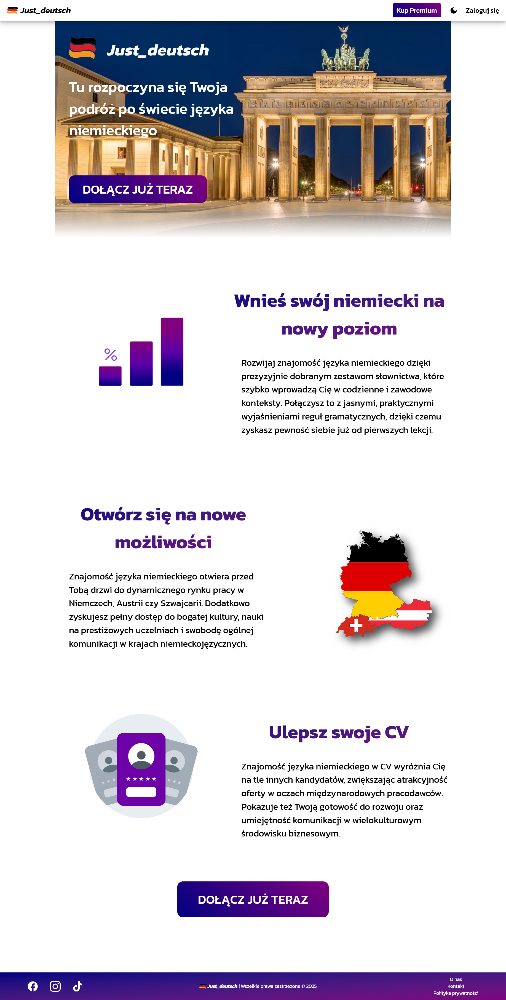
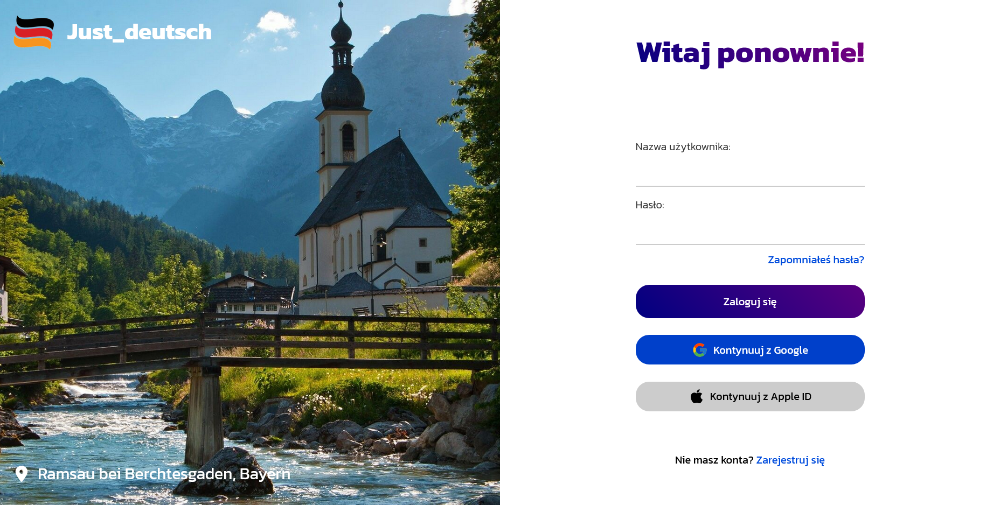
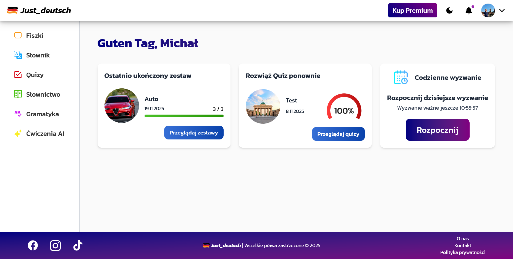
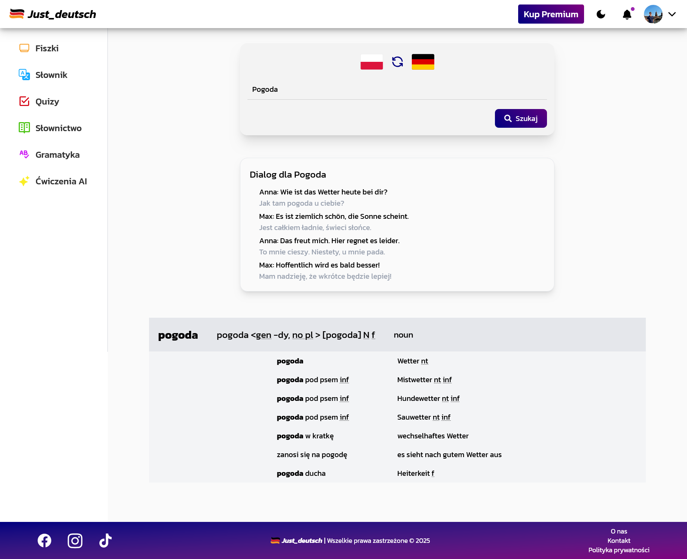
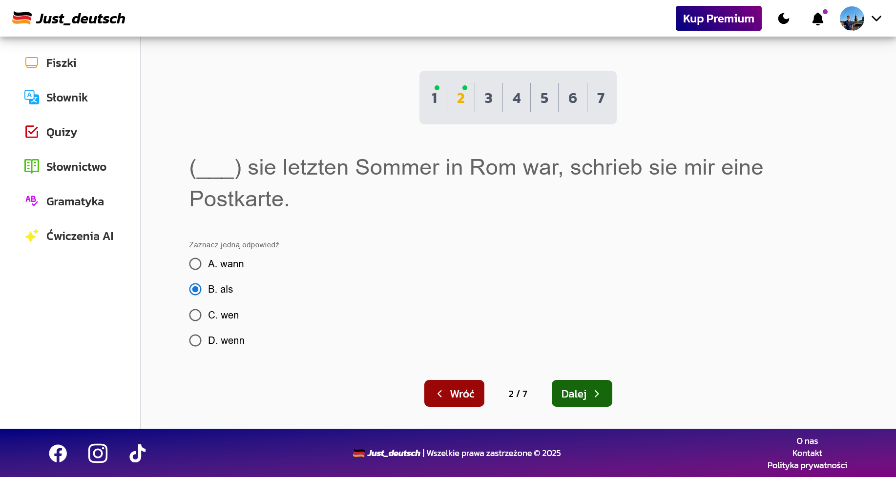
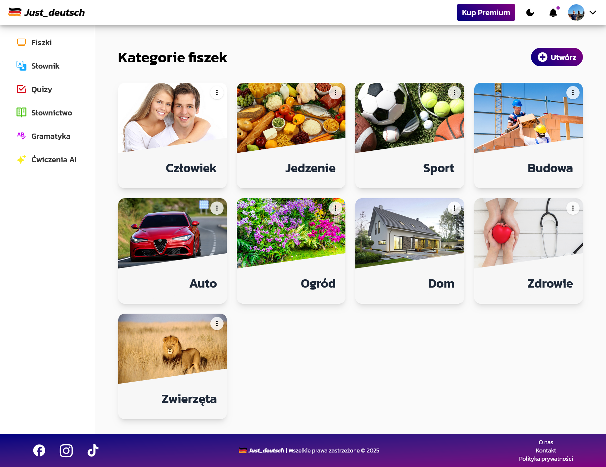
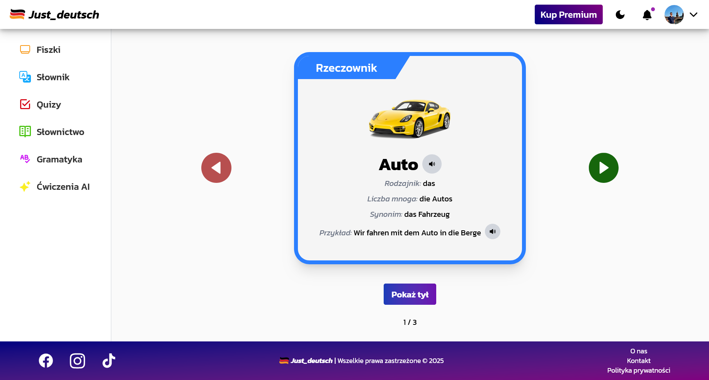
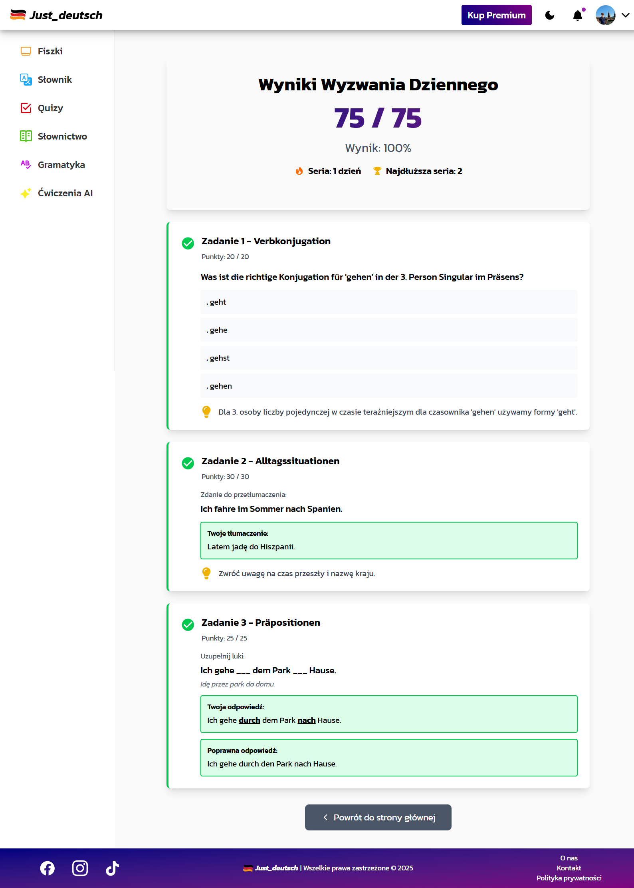

# 
#  Just_Deutsch

A web application for learning German, enhanced by Artificial Intelligence.
The platform uses external APIs — a dictionary API (PONS) and an AI service (OpenAI) — to generate personalized learning tasks and exercises based on the user's language level and preferences.
Users can practice via quizzes, flashcards, AI-generated gap-fill and sentence translations exercises, and a daily challenges module.\
 ### 🚨 IMPORTANT: This is my engineering thesis whose code is currently private
 

## About the Project
Just_Deutsch is an online learning application aimed at helping users learn German in a flexible, personalized way.\
Using AI-powered task generation via OpenAI, the application adapts to each user's language level and preferences to provide:\
•	tailored daily tasks,\
•	quizzes, flashcards, sentence translations,\
•	gap-fill exercises generated by AI,\
•	a mix of vocabulary, grammar, reading — depending on user settings.

The goal is to create a dynamic learning environment where content evolves with the learner, without manual preparation of each exercise.

## Features
•	User-level based customization (beginner / intermediate / advanced)\
•	AI-generated daily tasks and exercises (via OpenAI)\
•	Dictionary lookups (via PONS API)\
•	Quizzes — single-choice question in the current version\
•	Flashcards for vocabulary practice\
•	AI-generated sentences translation practice\
•	AI-generated gap-fill exercises (cloze tests)\
•	Daily exercise module — for habitual learning

## Technologies
### Frontend:
•	HTML, Tailwind CSS, React JS
### Backend  / API integrations:
• Django\
• PostgreSQL database stored in Docker\
•	Integration with PONS Dictionary API\
•	Integration with OpenAI API for generating exercises and daily challenges
### Others:
•	Ready-made components and icons from Material UI and React Icons\
• Animated icons from LottieFiles

## Example screenshots

  
  
  
  
  
  
  

## Future Improvements / TODO
• Make a deploy\
•	Improve UI/UX — responsive design,  accessibility\
•	Add support for more exercise types — pronunciation trainer, listening comprehension, writing tasks\
•	Add caching for API calls\
•	Add tests for backend logic / frontend components\
•	Add vocabulary and grammar pages that will contain didactic content
